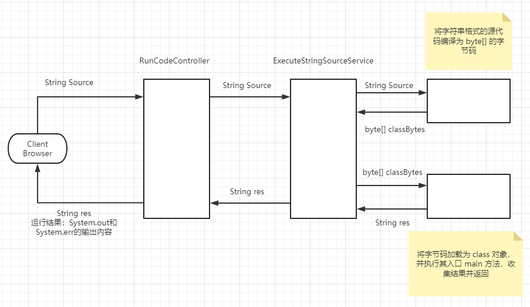
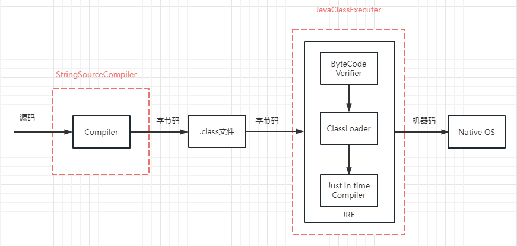

# web-ide

*参照 https://github.com/TangBean/OnlineExecutor 项目*

> 执行流程：

+ 编译：使用动态编译，将客户端的字符串源码编译为字节数组
+ 字节码修改器：根据 Class 文件结构，将客户端对系统 System 的调用替换为自己实现的 HackSystem
+ 运行：自定义加载器实现类的加载&热替换，并通过反射执行 main 方法
+ 通过 `ThreadLocal` 解决多用户情况下存在的并发问题

> 实现

**StringSourceCompiler：**将字符串形式的源码编译为字节数组

**JavaClassExecuter：**将字节码加载进 JVM，并执行其 mian 方法，收集运行结果（`System.out` 和 `System.err`）